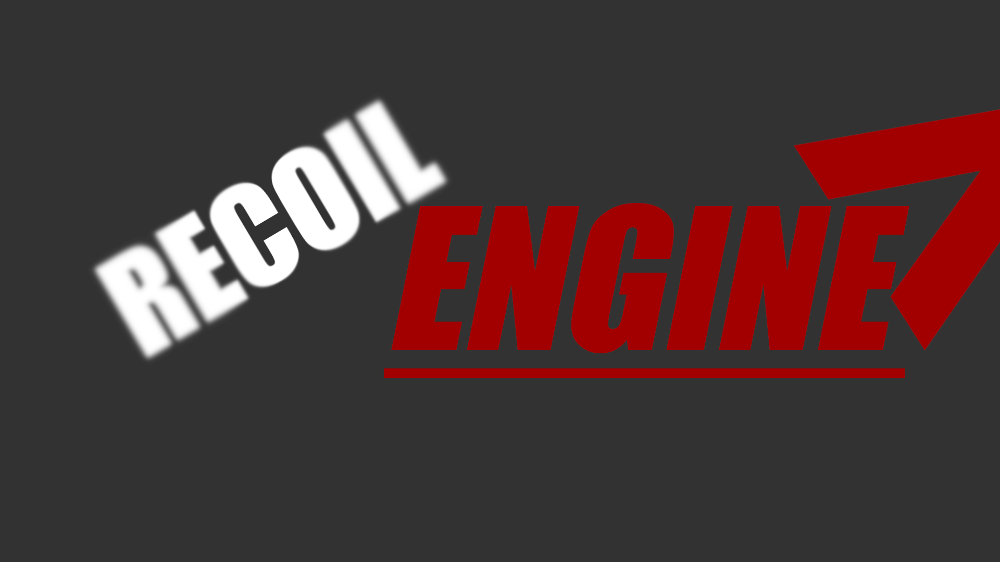

# RECOIL ENGINE FOR UNITY

## Recoil Engine is a procedural recoil system namespace for the Unity game engine.

# SHOWCASE
## Recoil Engine working in my own project with my gun system. (Some aspects, such as returning the weapon from the recoil itself are handled within the weapon system, not Recoil Engine)

# SCRIPT EXAMPLE
## Basic example script on how to set-up Recoil Engine in a script.
https://github.com/TheToolmansCoffee/RecoilEngineVariables/assets/93699568/697625d6-6e55-4bbd-9950-fc45ce994c1f

# DOCUMENTATION
## How to use the RecoilEngineVariables namespace.

### 1. Call the RecoilEngineVariables namespace;
